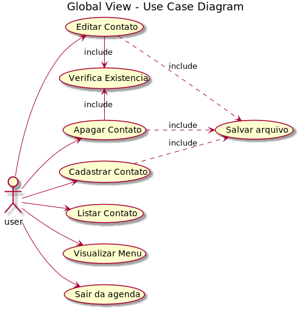
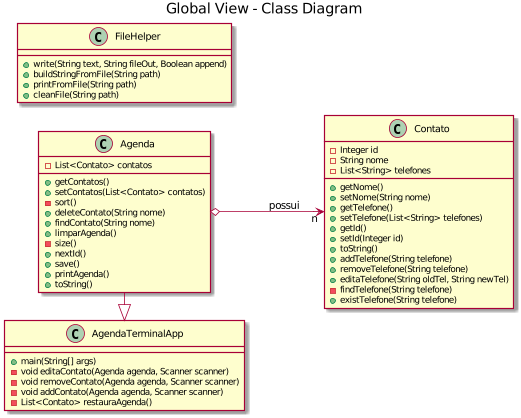
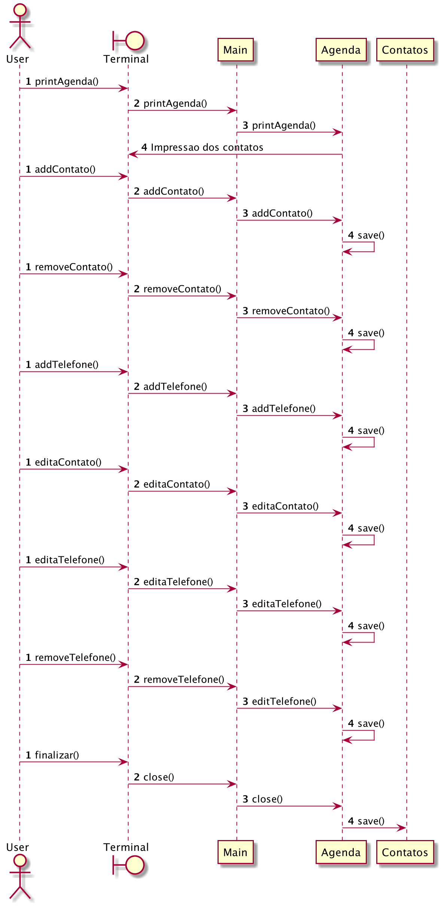

``` 
 █████╗  ██████╗ ███████╗███╗   ██╗██████╗  █████╗     ██████╗ ██████╗ 
██╔══██╗██╔════╝ ██╔════╝████╗  ██║██╔══██╗██╔══██╗    ██╔══██╗██╔══██╗
███████║██║  ███╗█████╗  ██╔██╗ ██║██║  ██║███████║    ██║  ██║██████╔╝
██╔══██║██║   ██║██╔══╝  ██║╚██╗██║██║  ██║██╔══██║    ██║  ██║██╔══██╗
██║  ██║╚██████╔╝███████╗██║ ╚████║██████╔╝██║  ██║    ██████╔╝██████╔╝
╚═╝  ╚═╝ ╚═════╝ ╚══════╝╚═╝  ╚═══╝╚═════╝ ╚═╝  ╚═╝    ╚═════╝ ╚═════╝ 
                                                                                                                                                           
```
Power By: Leonardo Maximino de Mendonça

## Introdução
O Sistema **AGENDA DB** consiste em uma aplicação executavel via linha de comando com o foco em 
substituir agendas manuscristas por um sistema simples e programavel.

A estrutura do sistema está dividia no padrão MVC onde os Models se encontram no diretorio 
```src/main/java/model```, os Controllers no diretorio ```src/main/java/controller``` e a View no 
arquivo```src/main/java/AgendaDbApp.java```.

## Tecnologias aplicadas
Para a realização do projeto foi utilizado a linguagem Java na versão 8 junto com o SQLite como SGBD, 
além do maven como gerenciador de dependencias.

## Quick-start
Primeiro, tenha certeza que pussi instalado o Java vesão 8, & uma versão recente do maven.

Abra o terminal e insira os seguintes comandos.

```
git clone git@trab.dc.unifil.br:leonardo.maximino/agenda-db.git
cd agenda-db/

mvn install

java -jar target/agenda-db-1.0.0.jar

```


## Docs
O codigo utilizado para gerar os diagramas estão no diretorio ```docs/diagrams/src```, abaixo está
listado as imagens dos diagramas disponiveis:

#### Caso de Uso


#### Classe


#### Sequencia



